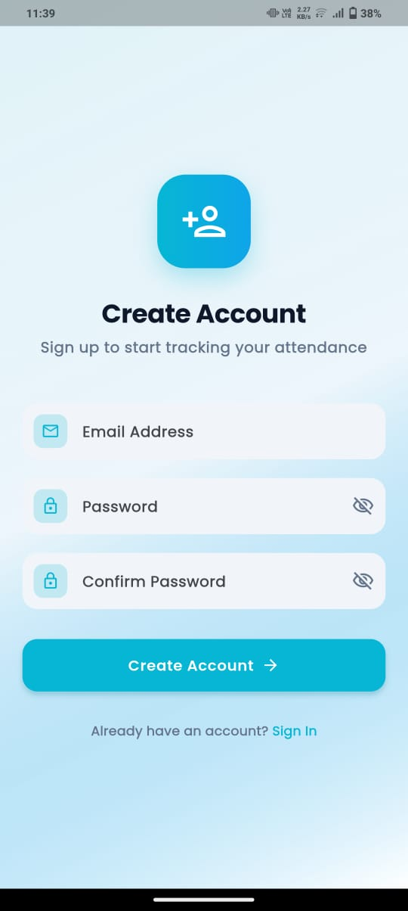
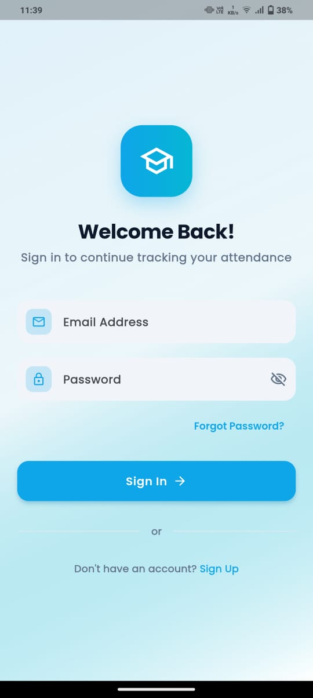
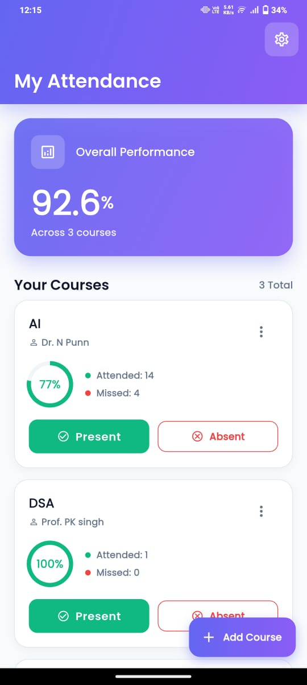
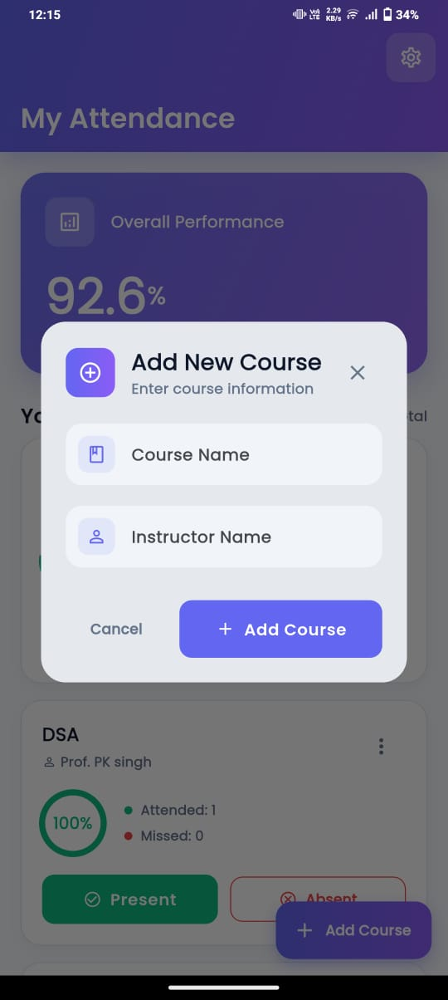
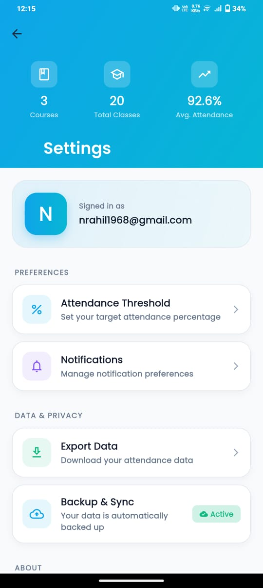
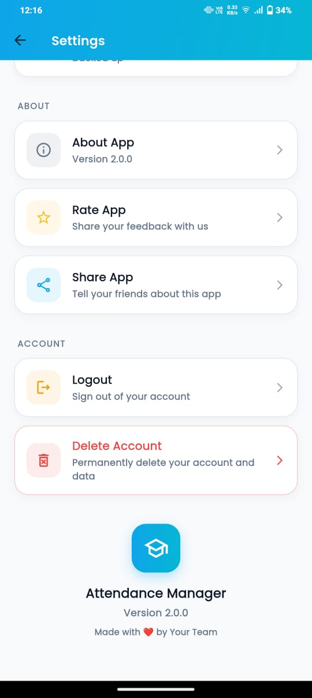
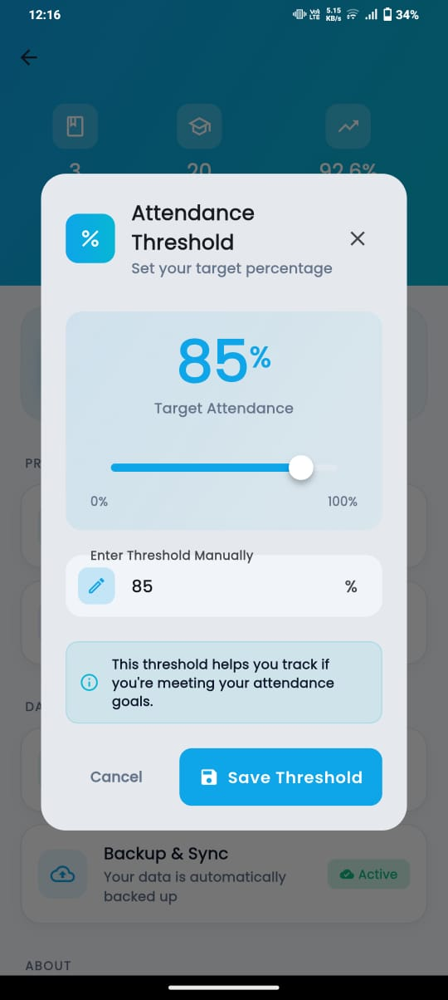

# 📚 Attendance Manager

A personalized Flutter application designed to help university students manage their class attendance. It provides a clean, user-friendly interface to track attendance percentages in real time, gain valuable insights, and efficiently manage their courses.

---

## ✨ Features

- *Secure Authentication*: Users can securely sign up and log in using Firebase Authentication.  
- *Real-time Dashboard*: The home screen provides an overview of all courses and an overall attendance percentage, updated in real time.  
- *Quick Attendance Tracking*: Mark a class as "attended" or "missed" with a single tap directly from the dashboard.  
- *Course Management*: A single, reusable dialog is used to easily add, edit, and delete courses.  
- *Detailed Analytics*: A dedicated screen for each course provides insights, including classes attended, missed, and a projection of how many classes you can afford to miss to stay above your target threshold.  
- *Customizable Settings*: Users can set their desired attendance percentage threshold, which is used for analytics and visual cues.  

---

## 🚀 Tech Stack

- *Flutter*: The primary framework for building the cross-platform application.  
- *Firebase Authentication*: For handling user registration and login securely.  
- *Cloud Firestore*: The NoSQL database used to store and sync all user data, including course information and attendance records.  

---

## 📸 Screenshots  

| Sign Up | Sign In | Home |
|:--:|:--:|:--:|
|  |  |  |

| Add New | Course Details | Settings 1 |
|:--:|:--:|:--:|
|  |  |  |

| Settings 2 | Threshold Dialog |
|:--:|:--:|
|  |  |

---

## 🎥 Demo Video  

🎬 **Watch the demo of the Attendance Manager app here:**  
👉 [Click to View on Google Drive](https://drive.google.com/file/d/1CD-pLhCz1kkCE99m1GmJkZrpag93iuQg/view?usp=drive_link)